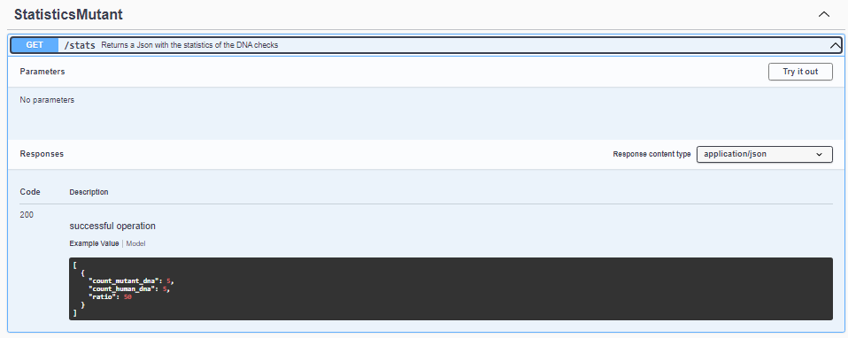

# backend-mutant
Esta es una api que sirve para validar si un humano tiene un ADN mutante.

## Pasos

## Descargar y construir en local

## Desde github
### Clone el repositorio, instale los paquetes de node y verifique las rutas localmente

``` 
//En local
git clone https://github.com/andresateho/backend-mutant.git
cd backend-mutant
npm install
npm start
```

Abra su navegador local y verifique que backend-mutant esté funcionando accediendo a:     
`http://localhost:9700/stats`   
`http://localhost:9700/mutant/`
`http://localhost:9700/api-docs`


**Nota**
No es necesario crear base de datos, actualmente se creó una base de datos en atlas mongoose para probar. 


## Swager


